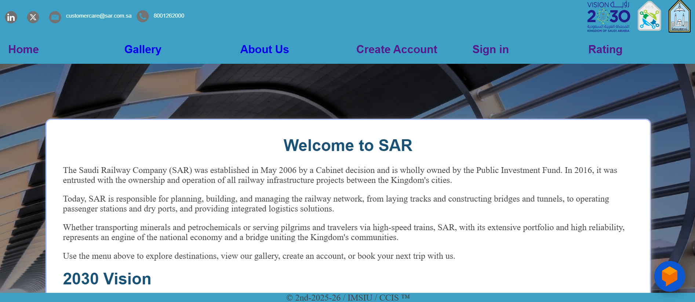
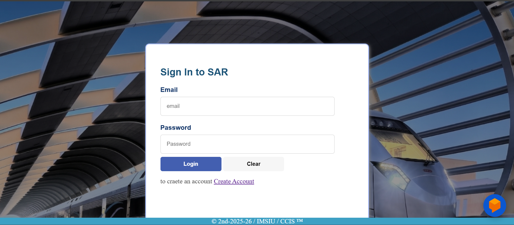
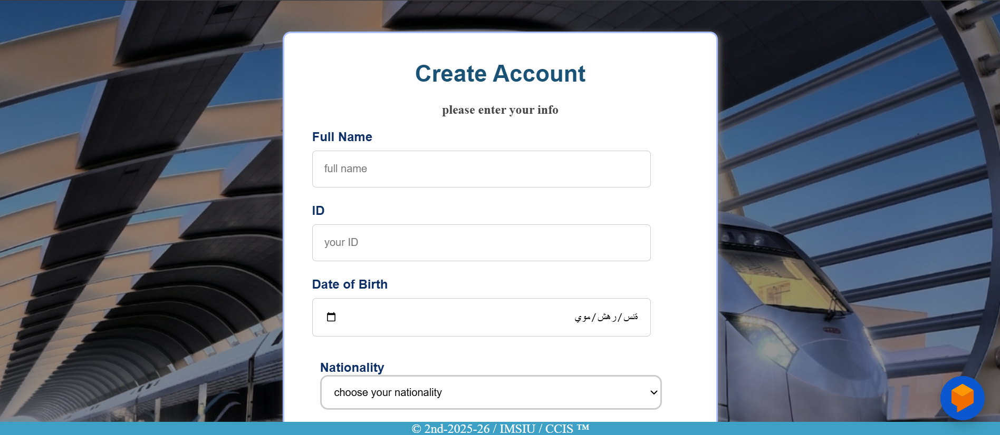
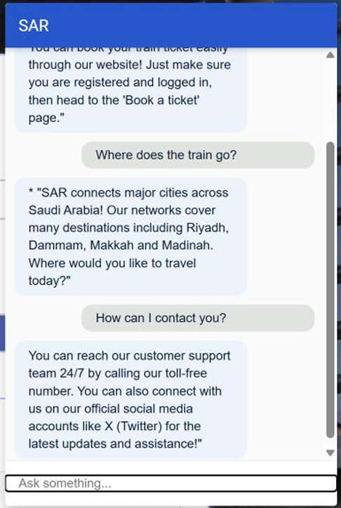

# 🚆 Saudi Arabia Railways (SAR) Website

<p align="center">
  
  
  
  
  
</p>

<p align="center">
  <b>An interactive railway booking website inspired by Saudi Arabia Railways (SAR)</b><br>
  Developed as part of the Application Development course.
</p>

---

# 📌 Overview

This project is a full-stack railway booking web application designed to simulate the services of Saudi Arabia Railways (SAR).
The website was developed using frontend and backend technologies to provide users with a smooth, secure, and interactive booking experience.

The project supports the goals of **Saudi Vision 2030** through:

* Digital transformation
* Smart services
* Enhanced user experience

---

# ✨ Features

## 🔐 Authentication System

* User Registration & Login
* CAPTCHA Verification
* Password Validation
* Duplicate Email Detection
* Session-Based Authentication

## 🎫 Ticket Booking System

* Interactive Booking Form
* Future Date Validation
* Group Booking Validation
* Booking Confirmation Messages

## ⭐ Ratings & Reviews

* Submit Ratings & Comments
* Guest & Registered User Support
* Database-Stored Feedback
* Reviews Displayed from Newest to Oldest

## 🤖 AI Chatbot

Integrated chatbot using Dialogflow to help users with:

* Booking assistance
* Train destinations
* Customer support
* Website services

## 🎨 Responsive User Interface

* Consistent design across pages
* Easy navigation
* Protected booking pages
* Organized layout and styling

---

# 🛠️ Technologies Used

| Technology | Purpose                    |
| ---------- | -------------------------- |
| HTML5      | Website Structure          |
| CSS3       | Styling & Layout           |
| JavaScript | Validation & Interactivity |
| PHP        | Backend Development        |
| MySQL      | Database Management        |
| Dialogflow | AI Chatbot                 |
| XAMPP      | Local Server Environment   |
| phpMyAdmin | Database Administration    |
| VS Code    | Development Environment    |

---

# 📂 Website Pages

* 🏠 Home Page
* 🔑 Login Page
* 📝 Sign Up Page
* 🚄 Travel Page
* 🖼️ Gallery Page
* 🎫 Book Ticket Page
* 👥 About Us Page
* ⭐ Ratings Page

---

# 📸 Screenshots

> Create a folder named `images` and place your screenshots inside it.








---

# 🗄️ Database Structure

## Users Table

Stores:

* Full Name
* National ID
* Date of Birth
* Nationality
* Mobile Number
* Email Address
* Username
* Encrypted Password

## Ratings Table

Stores:

* Username / Guest
* Rating Score
* User Comments
* Submission Date & Time

---

# 🔍 Validation Features

The system includes several validation mechanisms using JavaScript:

* Required Field Validation
* Password Strength Verification
* CAPTCHA Validation
* Preventing Past-Date Booking
* Group Booking Restrictions

---

# 🚀 How to Run the Project

## 1️⃣ Install XAMPP

Download and install XAMPP.

## 2️⃣ Move Project Folder

Move the project folder into:

```bash
htdocs/
```

## 3️⃣ Start Services

Run:

* Apache
* MySQL

## 4️⃣ Import Database

Import the SQL database file using phpMyAdmin.

## 5️⃣ Open the Project

```bash
http://localhost/project-folder-name
```

---

# 🎯 Project Objectives

* Build a professional railway booking system
* Apply frontend and backend development concepts
* Improve user interaction and accessibility
* Implement secure authentication and validation
* Support Saudi Vision 2030 digital initiatives

---

# 📈 Future Improvements

* Real-time train schedules
* Arabic & English bilingual support
* Email confirmation system
* Online payment gateway
* Advanced AI chatbot features

---

# 👥 Team Project
Developed collaboratively for the Application Development course at
Imam Mohammad Ibn Saud Islamic University.

Developed by:
Shrowq Alharbi
jana hamad almanea
brooq alghamdi

---

# 📄 License

This project was developed for educational purposes only.
